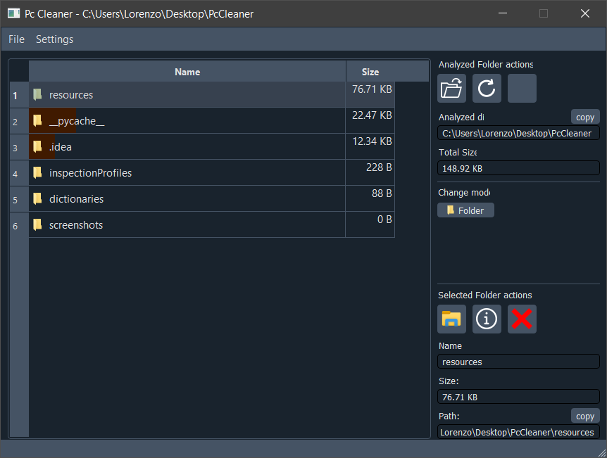
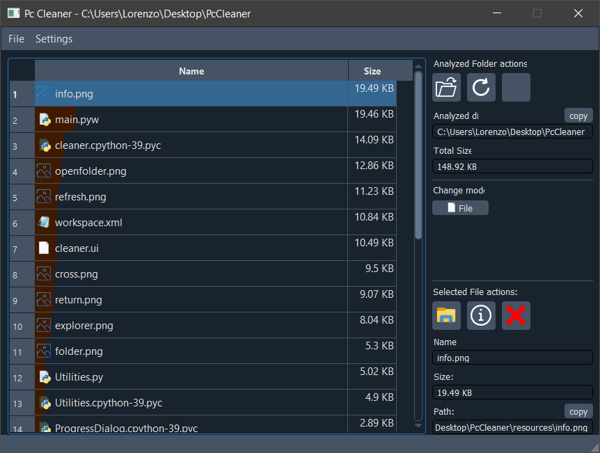

# Pc Cleaner

A small Python program to scan all files and folders in a selected path and list them based on their size.

## Functionality

- Select a path to scan with the folder icon.
- You can switch between "file mode" or "folder mode" to view the size of the files/folders.
- You can open the properties dialog on a selected file/folder.
- It is possible to delete a file/folder permanently from the program or open explorer on the file/folder path and delete manually.

## Screenshots

